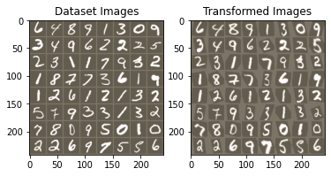

# Spatial Transformer Networks

## Input: Data Used
Here we use the standard MNIST data for the testing of spatial transformers

## Model Used
The spacial transformer introduces the concept of spatial invariance in the model. Here the model is used alongside a standard network to modify the image. This spatial transformation is a learnarble parameter.

The Model consists of 3 parts
 - The localization network
 - Grid generator
 - Sampler

#### The Localization Network
The localization network takes the input feature map and outputs the transformation.

#### Grid Generator
The input feature map is warped and the output is brought to a normal image based on the transformation given from the previous step.

#### Differentiable Image Sampling
The sampler takes a set of sampling points and outputs a transformed feature map.

## Output

### Link to Google Colab file
https://drive.google.com/file/d/1-74H6mwAfivTggtFEO42EmWDZIjAsH-C/view?usp=sharing

### Link to Github Notebook
https://github.com/reubenwenisch/Transformer/blob/main/spacial_transformer.ipynb